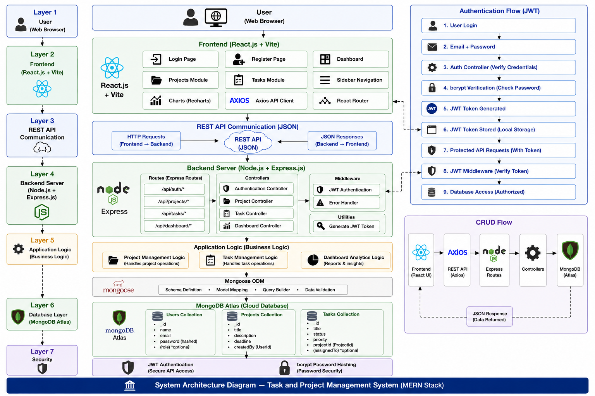
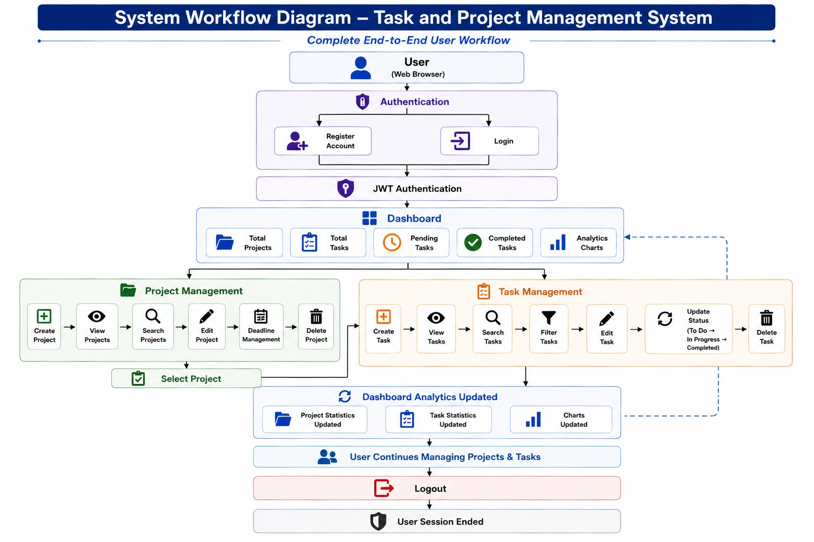

# Task and Project Management System


A full-stack MERN application that streamlines project planning, task management, progress tracking, and team productivity through an intuitive dashboard, secure authentication, and project-centric workflow management.

---

# Table of Contents

- Overview
- Key Features
- Technology Stack
- System Architecture
- System Workflow
- Database Design
- Project Structure
- REST API
- Screenshots
- Installation
- Environment Variables
- Project Highlights
- Future Enhancements
- License
- Author

# Overview

Task and Project Management System is a modern web-based project management platform designed to help students, freelancers, and small development teams organize projects efficiently.

The platform allows users to create projects, manage tasks, monitor project progress, organize priorities, and visualize productivity through interactive dashboard analytics.

Users can securely authenticate using JWT authentication, create multiple projects, assign and manage tasks, monitor project deadlines, and track overall project status from a centralized dashboard.

This project was developed using the MERN Stack to demonstrate full-stack web development concepts including authentication, REST API development, CRUD operations, database management, responsive frontend development, and dashboard analytics.

---

# Key Features

## Authentication Module

- User Registration
- Secure User Login
- JWT Authentication
- Protected Routes
- Session Management
- Logout Functionality
- Password Encryption using bcrypt

---

## Project Management Module

- Create New Projects
- Edit Existing Projects
- Delete Projects
- Project Description Management
- Deadline Tracking
- Project Search
- Responsive Project Cards

---

## Task Management Module

- Create Tasks
- Update Tasks
- Delete Tasks
- Task Priority Management
- Task Status Tracking
- Associate Tasks with Projects
- Search Tasks
- Filter by Status
- Filter by Priority

Task Status Workflow

```
To Do
      ↓
In Progress
      ↓
Completed
```

---

## Dashboard Module

Interactive Dashboard displaying:

- Total Projects
- Total Tasks
- Completed Tasks
- Pending Tasks
- Task Distribution Chart
- Task Status Analytics
- Project Overview
- Productivity Summary

---

## User Interface

- Responsive Dashboard
- Sidebar Navigation
- Modern Card Layout
- Responsive Forms
- Search Functionality
- Interactive Charts
- Clean and Minimal Design
- Mobile Friendly Layout

---

# Technology Stack

| Category | Technologies |
|----------|--------------|
| Frontend | React.js, Vite, Tailwind CSS, Axios, React Router DOM |
| Backend | Node.js, Express.js |
| Database | MongoDB Atlas, Mongoose ODM |
| Authentication | JWT, bcrypt |
| Charts | Recharts |
| Tools | Git, GitHub, VS Code, Postman |

---


# System Architecture Diagram

The following diagram illustrates the overall architecture of the Task and Project Management System. It shows how the React frontend communicates with the Express backend through REST APIs, how business logic is processed, and how data is stored securely in MongoDB Atlas using JWT-based authentication.

<p align="center">
  
</p>

---

# System Workflow Diagram

The following workflow diagram illustrates the complete end-to-end user interaction within the Task and Project Management System, from user authentication to project and task management, dashboard analytics updates, and secure logout.

<p align="center">
  
</p>

---

# Database Design

Collections used in the application:

### Users

| Field    | Type   |
| -------- | ------ |
| name     | String |
| email    | String |
| password | String |


### Projects

- Title
- Description
- Deadline
- Created By

### Tasks

- Title
- Description
- Status
- Priority
- Project Reference

---

# Project Structure

```text
Task-and-Project-Management-System/
│
├── client/
│   ├── public/
│   ├── src/
│   │   ├── api/
│   │   ├── assets/
│   │   ├── components/
│   │   ├── context/
│   │   ├── layouts/
│   │   ├── pages/
│   │   ├── routes/
│   │   ├── App.jsx
│   │   ├── main.jsx
│   │   └── index.css
│   │
│   ├── package.json
│   ├── vite.config.js
│   ├── tailwind.config.js
│   └── postcss.config.js
│
├── server/
│   ├── config/
│   ├── controllers/
│   ├── middleware/
│   ├── models/
│   ├── routes/
│   ├── utils/
│   ├── server.js
│   └── package.json
│
├── screenshots/
│
├── docs/
│
├── .gitignore
└── README.md
```

---

# REST API Endpoints

## Authentication

```
POST   /api/auth/register
POST   /api/auth/login
```

---

## Dashboard

```
GET    /api/dashboard
```

---

## Projects

```
GET    /api/projects
POST   /api/projects
PUT    /api/projects/:id
DELETE /api/projects/:id
```

---

## Tasks

```
GET    /api/tasks
POST   /api/tasks
PUT    /api/tasks/:id
DELETE /api/tasks/:id
```
# Screenshots

## Login Page

<p align="center">
  
</p>

---

## Registration Page

<p align="center">
  
</p>

---

## Dashboard

<p align="center">
  
</p>

---

## Project Management

<p align="center">
  
</p>

---

## Task Management

<p align="center">
  
</p>

---


# Installation

## Clone Repository

```bash
git clone https://github.com/MonishGowdaSR/Task-and-Project-Management-System.git

cd Task-and-Project-Management-System
```

---

## Frontend Setup

```bash
cd client

npm install

npm run dev
```

Frontend runs on:

```
http://localhost:5173
```

---

## Backend Setup

```bash
cd server

npm install

npm start
```

Backend runs on:

```
http://localhost:5000
```

---

# Environment Variables

The following variables are required for database connectivity and secure authentication.

Create a `.env` file inside the server directory.

```env
PORT=5000

MONGO_URI=your_mongodb_connection_string

JWT_SECRET=your_jwt_secret
```

---

# Project Highlights

- Developed a complete MERN-based Task and Project Management platform.
- Designed responsive dashboard with real-time project statistics.
- Developed complete CRUD functionality for projects and tasks.
- Implemented dashboard analytics using Recharts.
- Built RESTful APIs following MVC architecture.
- Integrated MongoDB Atlas for cloud database management.
- Developed reusable React components and modular backend architecture.
- Created responsive UI using Tailwind CSS.
- Implemented project and task search functionality.

---

# Future Enhancements

- Team Collaboration
- Role-Based Access Control
- Calendar View
- Kanban Board
- File Attachments
- Activity Timeline
- Email Notifications
- Due Date Reminders
- Dark Mode
- Drag-and-Drop Task Management
- Project Progress Timeline
- AI-powered Task Suggestions *(Planned)*
- AI-generated Project Summary *(Planned)*

---

# License

This project was developed for educational, academic, and portfolio purposes.

Copyright © 2026 Monish Gowda S R.

This repository showcases software engineering, full-stack web development, REST API development, and modern MERN application architecture.

---

# Live Demo

Deployment coming soon.

# Author

## Monish Gowda S R

Bachelor of Engineering – Information Science & Engineering

MVJ College of Engineering, Bengaluru

**GitHub:** https://github.com/MonishGowdaSR

**LinkedIn:** www.linkedin.com/in/monishgowdasr
